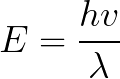
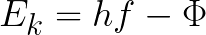

# Photoelectric Effect

A simple project that calculates whether photoemission occurs based on photon energy and work function, and visualizes the results with a graph. The program determines the likelihood of photoemission.

### Energy of Photon

**Where:**  
- **\(E\)** = Energy of radiation in Joules (J)  
- **\(h\)** = Planck's Constant (approximately \(6.626 \times 10^{-34} \, \text{Js}\))  
- **\(f\)** = Frequency of the radiation ray in Hertz (Hz)

### Derived Energy of Photon

 

**Where:**  
- **\(E\)** = Energy of radiation in Joules (J)  
- **\(h\)** = Planck's Constant (approximately \(6.626 \times 10^{-34} \, \text{Js}\))
- **\(v\)** = Velocity of the radiation ray in metres per second (m/s)
- **\(f\)** = Wavelength of the radiation ray in Metres (m)

### Maximum Kinetic Energy of Emiited Electron

**Where:**  
- **\(Ek\)** = Maximum kinetic energy of emitted electron in Joules (J)  
- **\(h\)** = Planck's Constant (approximately \(6.626 \times 10^{-34} \, \text{Js}\))
- **\(f\)** = Frequency of the radiation ray in Hertz (Hz)
- **\(Φ\)** = Work function of the material in Joules  (J)
