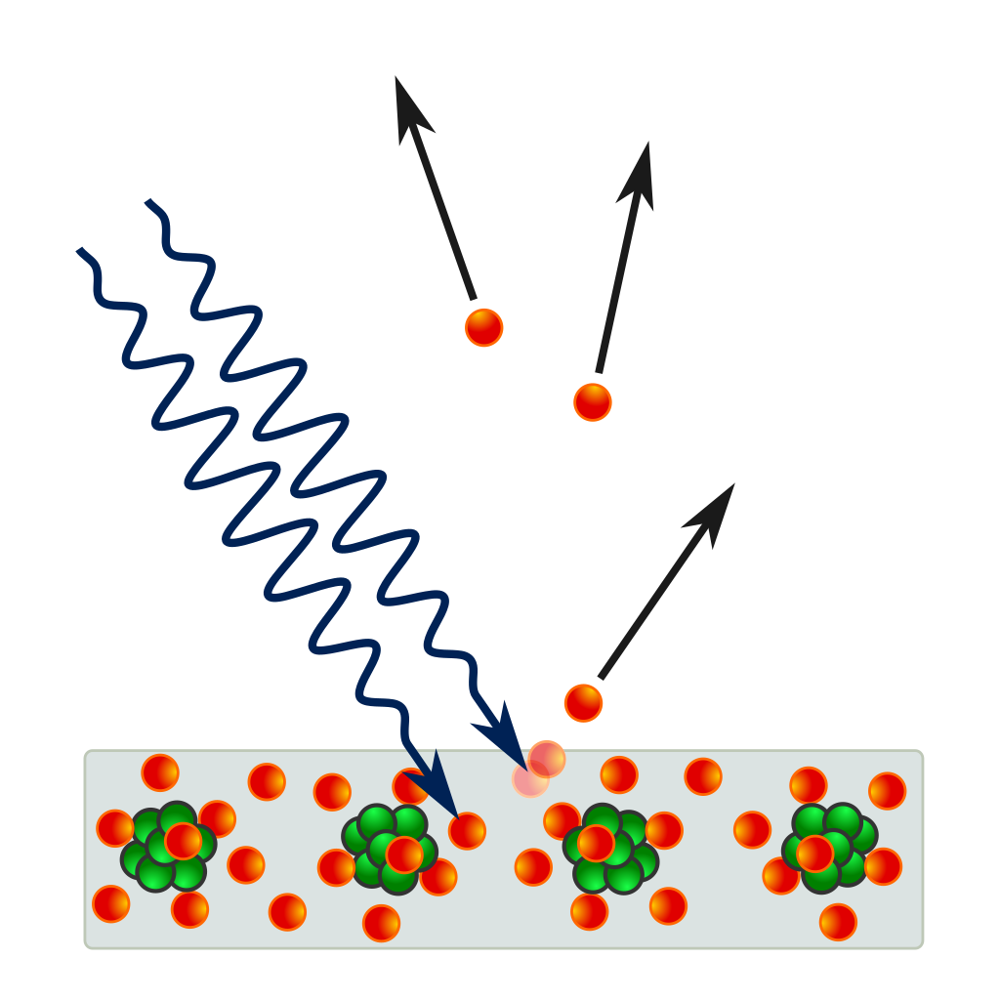

# Photoelectric-Effect
A simple project that calculates whether photoemission occurs based on photon energy and work function, and visualizes the results with a graph. The program determines the likelihood of photoemission.

