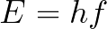

# Photoelectric Effect

A simple project that calculates whether photoemission occurs based on photon energy and work function, and visualizes the results with a graph. The program determines the likelihood of photoemission.

To calculate the energy of a photon, I used the following equation:

**Where:**  
- **\(E\)** = Energy of radiation in Joules (J)  
- **\(h\)** = Planck's Constant (approximately \(6.626 \times 10^{-34} \, \text{Js}\))  
- **\(f\)** = Frequency of the radiation ray in Hertz (Hz)  
